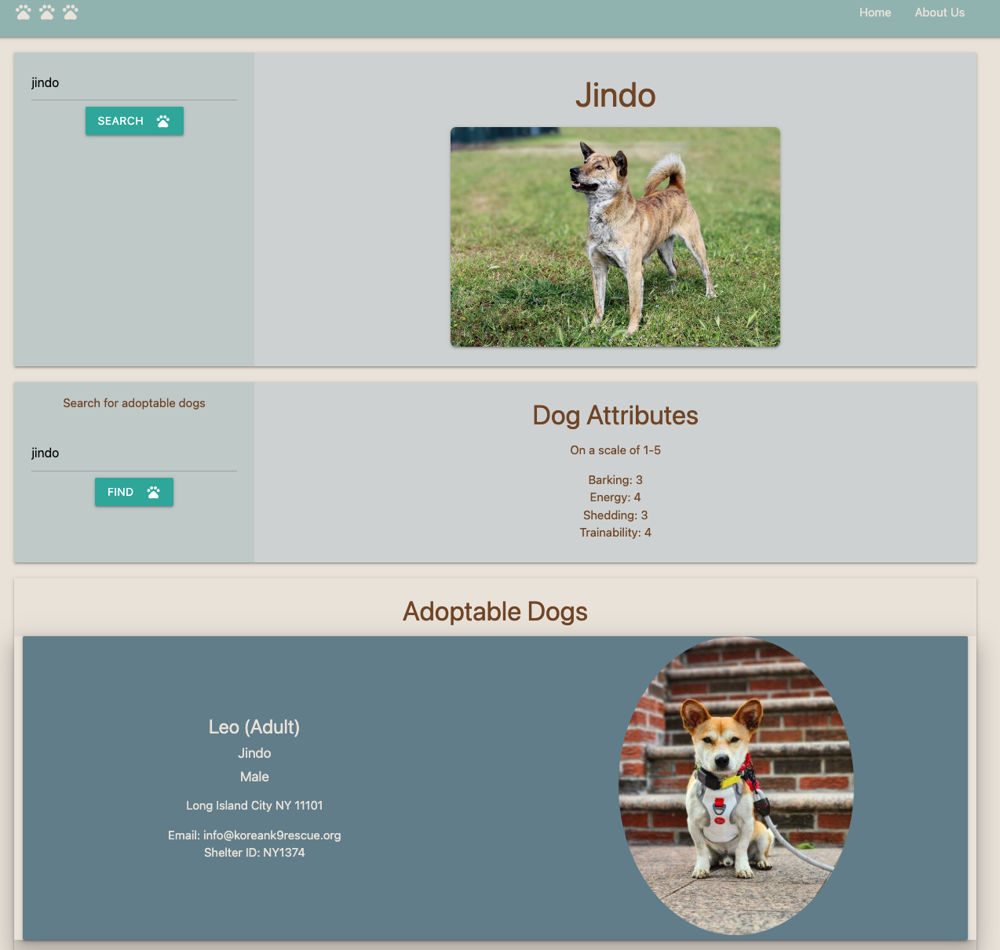

# Doggy GPS
> Future dog owners will be able to search different dog breeds, find its attributes, and discover places to adopt them.
> Live demo [_here_](https://esztergb.github.io/doggy-gps/). <!-- If you have the project hosted somewhere, include the link here. -->

## Table of Contents
* [General Info](#general-information)
* [Technologies Used](#technologies-used)
* [Features](#features)
* [Screenshots](#screenshots)
* [Usage](#usage)
* [Project Status](#project-status)
* [Room for Improvement](#room-for-improvement)
* [Acknowledgements](#acknowledgements)
* [Contact](#contact)
<!-- * [License](#license) -->

## General Information
Users will be presented with a homepage to click on in order to start searching for dog breeds they are interested in.  Once on the search page, the user will be able to search any dog breed, and a list of attributes will be displayed for that particular dog: barking, energy, shedding, trainability which are all rated on a scale of 1-5.  As soon as the user inputs a breed to search, it will immediately reveal in the search input below to find available dogs of that breed to adopt.

This app was created for anyone looking for a furry friend in their life.  It was created to make their lives a bit easier by being able to search for the type of dog and available dogs to adopt in one search engine.  Team Pewter City decided to undertake this project because we are all dog lovers.
<!-- You don't have to answer all the questions - just the ones relevant to your project. -->

## Technologies Used
- Petfinder for Developers
- Dogs API
- Materialize 1.0.0

## Features
- When searching for a specific dog, there are a list of attributes to give a brief description on what it is like to care for the searched dog.
- The site then searches for a breed and a shelter that houses the searched dog.
- Contact information is included as well as pictures of adoptable dogs.

## Screenshots

<!-- If you have screenshots you'd like to share, include them here. -->

## Usage
The user will need to click on the "FIND YOUR DOG" button on the homepage and will bring them to the search page.  There the user will type in a dog breed and a list of attributes will display.  If interested in that breed, it will immediately show in the search below to find available dogs to adopt.

## Project Status
Project is: _in progress_.

## Room for Improvement
- Add a drop down for search of dog breeds
- Add extra searchable parameters
- More in depth breed description

## Acknowledgements
- This project was inspired by us dog lovers.
- Many thanks to Micheal, Nirav and Julius.

## Contact
Created by Team Pewter City feel free to contact me!
Carter Pang(carter@pangweb.com), Kristine Kim(kristinehkim@gmail.com), Eszter(Eszterbarbuscia@gmail.com), Jed Smith(smith.jed.p@gmail.com)

<!-- Optional -->
<!-- ## License -->
<!-- This project is open source and available under the [... License](). -->

<!-- You don't have to include all sections - just the one's relevant to your project -->